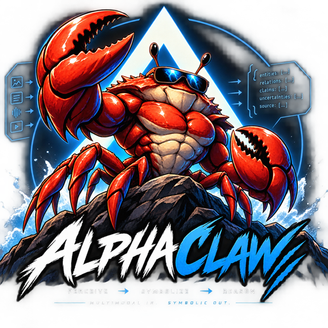
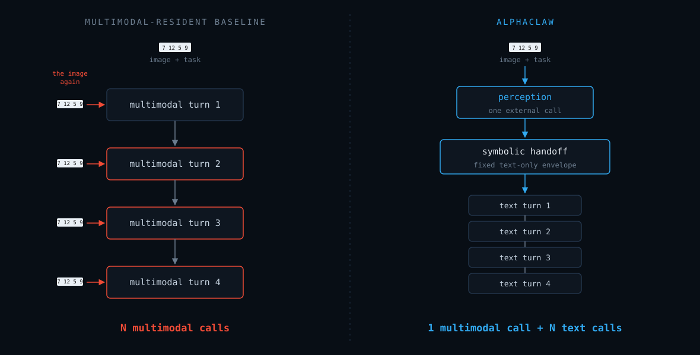
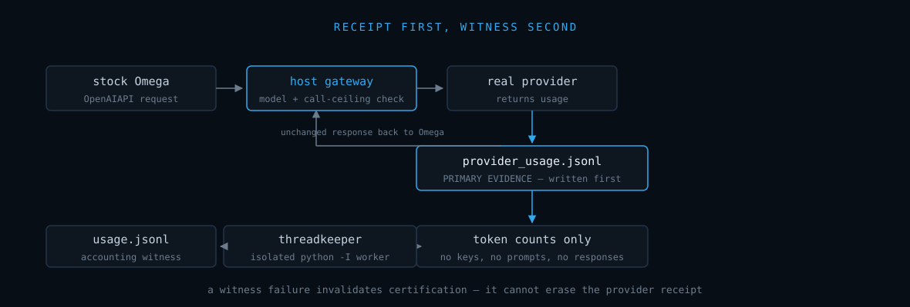
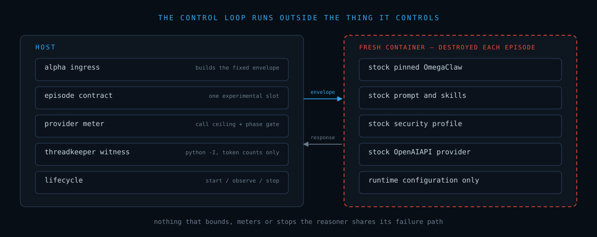

<p align="center">
  
</p>

<h1 align="center">AlphaClaw</h1>

<p align="center">
  <strong>Multimodal at the boundary. Text inference in the loop. Human authority around both.</strong>
</p>

<p align="center">
  <a href="https://youtu.be/IIjwI9CX4Vs">▶ Watch the 2:42 overview</a>
  &nbsp;·&nbsp;
  <a href="VIDEO.md">video notes</a>
  &nbsp;·&nbsp;
  <a href="RESEARCH.md">research checkpoint</a>
  &nbsp;·&nbsp;
  <a href="PHILOSOPHY.md">philosophy</a>
</p>

AlphaClaw is a small sensory tool for a text-only reasoning process.

The repository also carries deliberately separate experimental and human-development surfaces. They should not be confused with AlphaClaw itself.

```text
1. PERCEPTION
human / world
    -> AlphaClaw sensory boundary
    -> fixed text-only evidence envelope

2. INFERENCE
text handoff
    -> pinned upstream OmegaClaw

3. BOUNDED BENCHMARK APPARATUS
controller/
    -> one stock Omega Docker image
    -> fresh container per episode
    -> native Omega runtime bounds
    -> host-side lifecycle + provider-call bound

4. BENCHMARK ACCOUNTING
external/ThreadKeeper
    -> isolated accounting witness only

5. HUMAN DEVELOPMENT
GitHub Wiki
    -> public authored pages
```

The first is AlphaClaw proper. OmegaClaw and ThreadKeeper are pinned upstream dependencies. The controller is experimental apparatus. The Wiki is a human contribution surface.

## Research checkpoint

Protocols **v2** and **v3** are complete and frozen. Start at **[RESEARCH.md](RESEARCH.md)**
for the architecture, results, claims/non-claims and reproduction instructions.

Verify the published analysis offline -- no API key, no cost, no containers:

```
python scripts/verify_research_checkpoint.py
```

`benchmark/research-checkpoint.json` indexes every frozen artifact by SHA256.

## 1. AlphaClaw: sensory boundary

`ingress/` contains the AlphaClaw runtime idea.

`ingress/pipe.py` is the deterministic front door. It mechanically chooses only between text passthrough and supported multimedia perception. Text never invokes a sensory model. Both paths always converge on the same fixed Alpha prepend before anything is handed to OmegaClaw.

```text
text -------------------------------> fixed Alpha prepend -> text-only handoff
image -> one external perception ---> fixed Alpha prepend -> text-only handoff
```

<p align="center">
  
</p>

<p align="center"><em>The perception call is an architectural setup cost, not one of the
<code>N</code> reasoning steps.</em></p>

For already-textual input:

```bash
python ingress/pipe.py --text "your message"
```

For an image:

```bash
export OPENROUTER_API_KEY=...
python ingress/pipe.py --input-file image.png
```

Unsupported media fails closed rather than being guessed at. Measured image ingress also fails closed if OpenRouter does not return token usage; unknown sensory cost is never recorded as zero.

The fixed prepend tells OmegaClaw that its handoff is text-only evidence. OmegaClaw must not pretend that the handoff itself provides direct image, audio, video, or other multimedia perception; further multimedia perception requires an explicitly authorized external perception tool.

The controller may fill one explicit `episode_contract` slot in that envelope during bounded experiments. It cannot replace or mutate Alpha's fixed sensory contract.

AlphaClaw does not own the reasoning loop, lifecycle, memory, permissions, deployment, model selection, or recursive authorization.

## 2. OmegaClaw: pinned upstream dependency

This repository does **not** implement OmegaClaw.

`OmegaClaw-Core/` is a pristine Git submodule pinned to one exact revision of the upstream `asi-alliance/OmegaClaw-Core` project. AlphaClaw does not silently fork it, rebrand its internals, or treat its implementation as AlphaClaw code.

The benchmark runner likewise does **not** rewrite a disposable Omega tree. It builds and reuses OmegaClaw's own Dockerfile from the exact pinned source, then starts a fresh container for each measured episode. The image is the experimental subject; runtime configuration and the host fixture define the experiment.

For OmegaClaw installation, operation, internal architecture, channels, providers, tools, and normal behavior, refer to the upstream OmegaClaw documentation and source. Questions or defects intrinsic to OmegaClaw belong upstream.

```text
perception != authority != inference
```

## 3. Bounded OmegaBoi experiments

`controller/` is benchmark apparatus. It is deliberately **not AlphaClaw** and is not an alternate OmegaClaw implementation.

The controller uses OmegaClaw's own runtime configuration seam:

```text
maxNewInputLoops = N
maxWakeLoops = 0
maxHistory = 0
wakeupInterval > episode timeout
commchannel = test
provider = OpenAIAPI
```

The default post-handoff grant is **50 reasoning loops**, matching the pinned OmegaClaw iterative default and the controller's hard ceiling. Fifty is a ceiling, not a target: the controller destroys the fresh container after the first post-handoff user response. Smaller deliberate experiments may use `--max-loops 1`, `--max-loops 7`, or another value from 1 through 50.

### Stock boot stays stock

OmegaClaw's normal startup reasoning is not raced away or patched out. It runs as stock Omega and is metered separately as `boot` usage.

When the first stock boot provider response reaches the host gateway, that request is already classified as boot. The controller then classifies future calls as episode calls and synchronously queues the prepared Alpha envelope into Omega's native test channel while Omega is still processing the boot response.

The first post-handoff provider request is allowed to reach the host gateway but is held there until Omega reaches its next iteration and any boot-time public messages have been drained. Only then is the episode request released to the real provider. This means the benchmark does not depend on winning a race against Omega's next `receive()` and cannot accidentally discard a very fast post-handoff answer as boot output.

The host-side gateway refuses to forward episode call `N + 1`. The model is told the bound, stock Omega is configured with the same bound, and an independent external witness caps paid post-handoff calls.

### Wake behavior

Pinned Omega currently grants `1 + maxWakeLoops` when a scheduled wake fires, so `maxWakeLoops=0` is not itself a proof of zero future wake inference.

The controller therefore also sets the first wake deadline later than the entire allowed episode lifetime. The fresh container is stopped after response, provider-budget exhaustion, provider/accounting failure, or timeout. The scheduled wake is outside the reachable lifetime of a valid one-shot benchmark without modifying Omega.

### Provider seam

Omega remains stock and uses its built-in generic `OpenAIAPI` provider. That documented OpenAI-compatible seam points to a small host-side metering gateway over `host.docker.internal`.

<p align="center">
  
</p>

```text
stock Omega OpenAIAPI request
        |
        +--> fixed model check
        +--> post-handoff call ceiling
        +--> phase gate during boot separation
        |
        v
real selected upstream provider
        |
        v
actual provider response + usage
        |
        +--> raw provider_usage.jsonl FIRST
        |
        +--> token counts only
                 |
                 v
             python -I
                 |
                 v
        pinned ThreadKeeper
        Record / Account only
                 |
                 v
             usage.jsonl
        |
        v
unchanged response back to stock Omega
```

The raw provider receipt is primary evidence. ThreadKeeper is a separate accounting witness; a ThreadKeeper failure invalidates certification but does not erase the provider receipt.

This profile intentionally studies stock Omega through its generic OpenAI-compatible provider seam. It does **not** claim to reproduce provider-specific Omega plugins such as ASI:One thinking options, OpenRouter cache policy, or OpenAI's Responses-API implementation. Benchmark claims must name the profile actually used rather than silently conflating those populations.

For OpenRouter the gateway requests returned usage accounting. For every upstream, missing usage invalidates the benchmark instead of being treated as zero.

A real run is human-initiated and requires an explicit provider credential. Example with ASI:One as the upstream endpoint:

```bash
export ASIONE_API_KEY=...
python controller/omegaboi.py \
  --text "hello" \
  --provider asione \
  --model asi1-ultra
```

A deliberately narrow one-call human-input experiment is explicit:

```bash
python controller/omegaboi.py \
  --text "answer once" \
  --provider asione \
  --max-loops 1
```

For a custom OpenAI-compatible endpoint:

```bash
export OPENAIAPI_API_KEY=...
python controller/omegaboi.py \
  --text "hello" \
  --provider openaiapi \
  --openaiapi-url http://host-or-service.example/v1 \
  --model your-model
```

For image evidence, Alpha perception happens first and its sensory trace is recorded separately:

```bash
export OPENROUTER_API_KEY=...
export ASIONE_API_KEY=...
python controller/omegaboi.py \
  --input-file image.png \
  --provider asione
```

### One image, fresh containers

The first local run builds a Docker image tagged from the pinned Omega SHA. Later runs reuse that exact local image unless `--rebuild-image` is explicitly requested.

Each episode gets a fresh container from that image and no persistent Omega memory volume. Omega's own memory writes can occur inside the container, but `maxHistory=0` prevents persistent-history recall and the writable layer is destroyed with the container.

The run manifest records the pinned Omega SHA and the concrete Docker image ID so a benchmark population can be tied to one actual execution substrate.

The controller is intentionally the default supported way to produce benchmark claims. A developer who wants standing, autonomous, or otherwise unbounded OmegaClaw must deliberately bypass this apparatus and run upstream OmegaClaw directly. That is allowed, but it is a different population and must not be presented as an AlphaClaw bounded benchmark result.

### Host transport trust boundary

The reasoning subject stays inside its fresh container. The host controller does deliberately reuse one small piece of the exact pinned Omega checkout: `Autotests.mock.comm`, Omega's native test-channel RPC transport. That transport code is therefore an explicit trusted fixture dependency, not an accidental claim that arbitrary Omega code is trusted on the host.

The old standalone `omega_mock_bridge.py` path has been removed so collaborators have one supported bounded benchmark route rather than a tempting bypass around the controller.

## 4. ThreadKeeper: benchmark accounting only

`external/ThreadKeeper/` is a second pinned Git submodule. It exists here because Larry Greenblatt's ThreadKeeper already provides the token-accounting seam needed for the experiments.

ThreadKeeper stays on the **host side**, but its code is not imported into the controller interpreter. The provider gateway preserves the real provider-returned usage receipt first. It then launches a short-lived isolated Python worker with `python -I`; that worker loads the exact pinned `ThreadKeeper/src/threadkeeper_budget.py` file and receives only token counts plus accounting paths.

ThreadKeeper receives no provider credentials, prompt text, response text, Docker authority, or Alpha envelope. It does not choose providers, route work, set loop bounds, alter the Alpha prepend, select actions, or decide whether an answer is good.

Benchmark accounting is stricter than ThreadKeeper's normal runtime semantics: if a real provider response does not expose usage, or if the accounting witness cannot persist its record, the benchmark is invalid rather than silently counting zero tokens. The raw provider receipt remains even if the witness fails.

Outputs include:

```text
manifest.json
alpha-envelope.json
ingress-trace.json
usage.jsonl              # isolated ThreadKeeper-normalized counts
provider_usage.jsonl     # primary raw provider usage + boot/episode phase
container.log
response.txt             # when a post-handoff response was emitted
```

Default local runs are written under `benchmark-runs/`, which is intentionally ignored by Git so prompts, responses, logs, and receipts are not casually committed as source.

## 5. Contributor Wiki

The [AlphaClaw Wiki](https://github.com/PaulTiffany/AlphaClaw/wiki) is the public project notebook.

Its Home page is a small AlphaClaw landing page that humans can improve over time. The beginner open-source lesson lives on the Wiki's **Contributing** page.

A Wiki save changes the Wiki only. It does not run OmegaClaw, become AlphaClaw sensory input, change `main`, or trigger an automatic path into the codebase.

`contributor/README.md` is the short source text mirrored to Wiki `Contributing.md`.

## Local-first controller experiments

The controller keeps the experimental fixture outside the subject:

<p align="center">
  
</p>

```text
HOST
  Alpha ingress
  episode contract
  provider meter
  isolated ThreadKeeper witness
  pinned Omega mock transport
  start -> observe -> stop lifecycle
          |
          v
FRESH CONTAINER
  stock pinned OmegaClaw
  stock prompt and skills
  stock security profile
  stock OpenAIAPI provider
  runtime configuration only
```

This is not a claim that stock OmegaClaw is intrinsically safe. It is a claim that the benchmark does not hide a fork of the thing it says it is studying. Omega's own container isolation and security profile remain in force, while the outer controller supplies the finite experimental boundary.

Live-provider experiments remain human-initiated edge operations. There is no standing repository workflow that spends inference tokens.

## Development invariant

Before adding a mechanism, capability, workflow, resident process, or controller layer, ask:

> **WHY DO WE NEED THAT?**

Documentation machinery has to answer the same question. A runtime capability must also justify the authority it adds.

**Alpha senses. Omega reasons. The benchmark controller bounds. ThreadKeeper measures. Humans authorize and judge.**

## Philosophy

`PHILOSOPHY.md` is the normative human-facing companion to these boundaries. It includes commitments around fallibility, recoverability, provenance, operator slack, capability versus permission, and bounded recursive improvement.

## License and attribution

AlphaClaw original code: MIT © 2026 Paul Carver Tiffany III and Derek Tiffany.

The project video and the diagrams under `assets/diagrams/` are licensed
[CC BY 4.0](LICENSE-MEDIA) — share and adapt with credit. Music in the video is
carried under its own Pixabay licence and is not relicensed.

`OmegaClaw-Core` and `external/ThreadKeeper` are upstream works and retain their own upstream licenses, authorship, documentation, and notices.